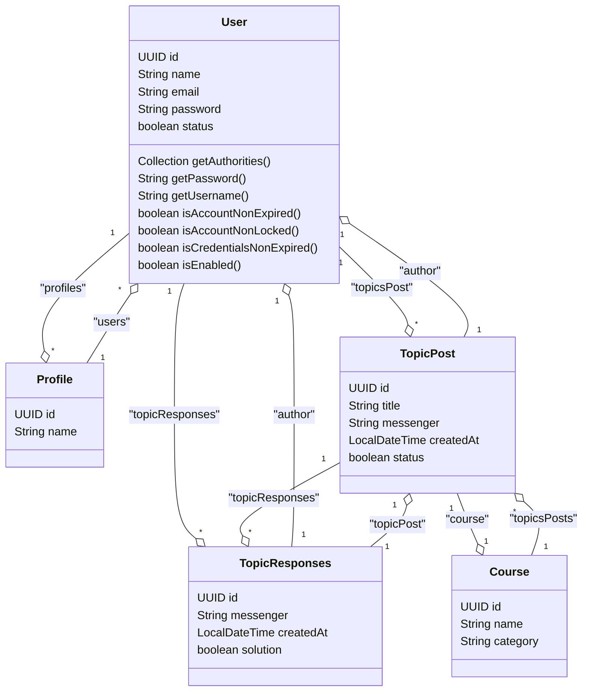

# Hub Forum API

#### Project challenge proposed by Alura in partnership with Oracle Next Education(ONE) in the JAVA Back-end course.

## Requirements

- [JAVA (version 17 onwards)](https://www.oracle.com/br/java/technologies/downloads)
- [Maven](https://maven.apache.org/install.html)
- [MySQL](https://dev.mysql.com/downloads/mysql/)
## Class Diagram

## Cloning and configuring the project
1. Run in terminal:
    ```bash
    git clone git@github.com:woliveira1728/forum-hub-api.git
    ```
2. Configure a MySQL database, define connection details and access credentials in the application.properties file
3. Starting the Server
    ```bash
    mvn spring-boot:run
    ```
4. Navigate to http://localhost:8080 to access the API.
5. Routes
   - Access route documentation at http://localhost:8080/swagger-ui/index.html.
